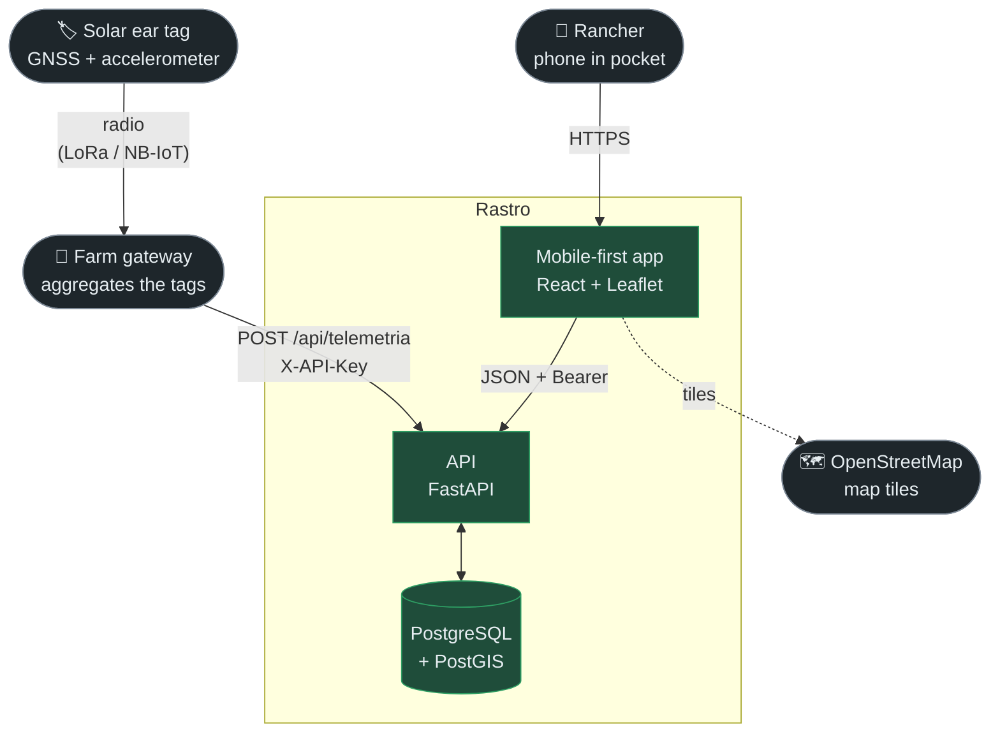
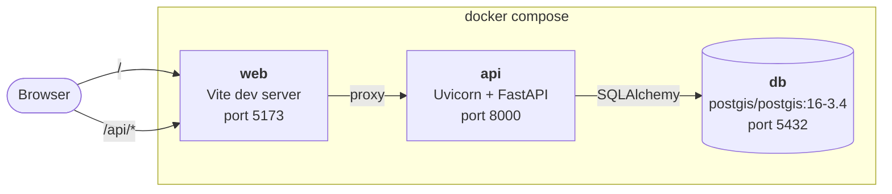
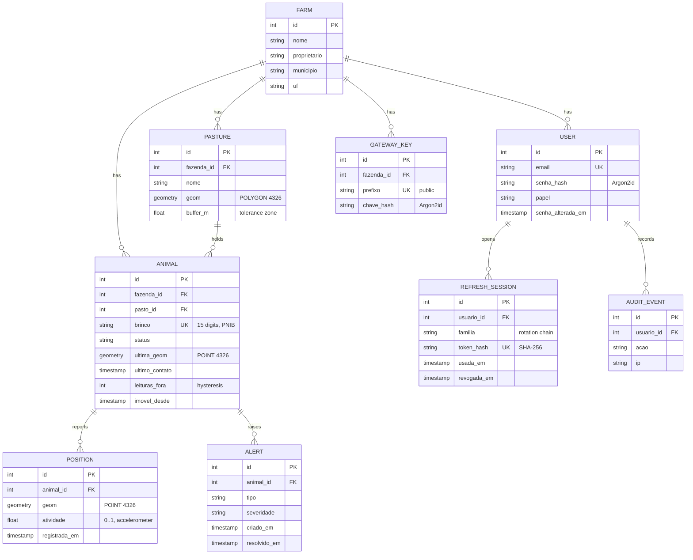
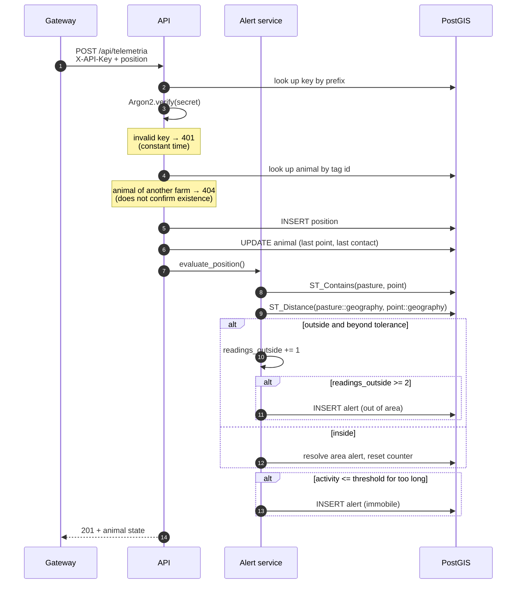
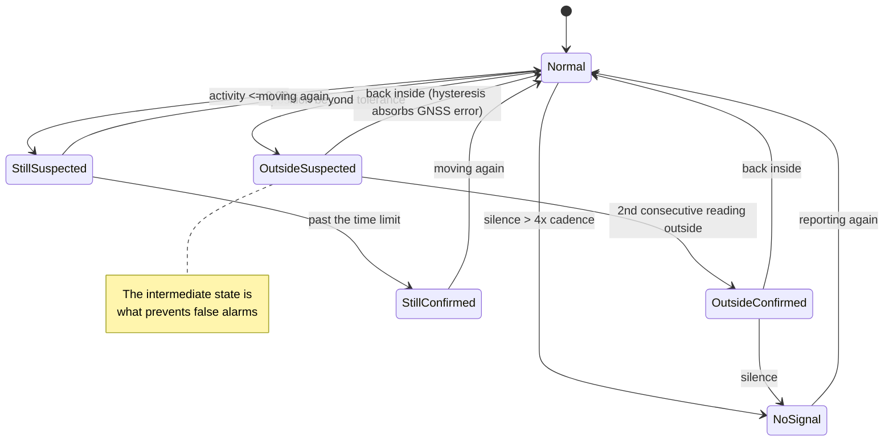
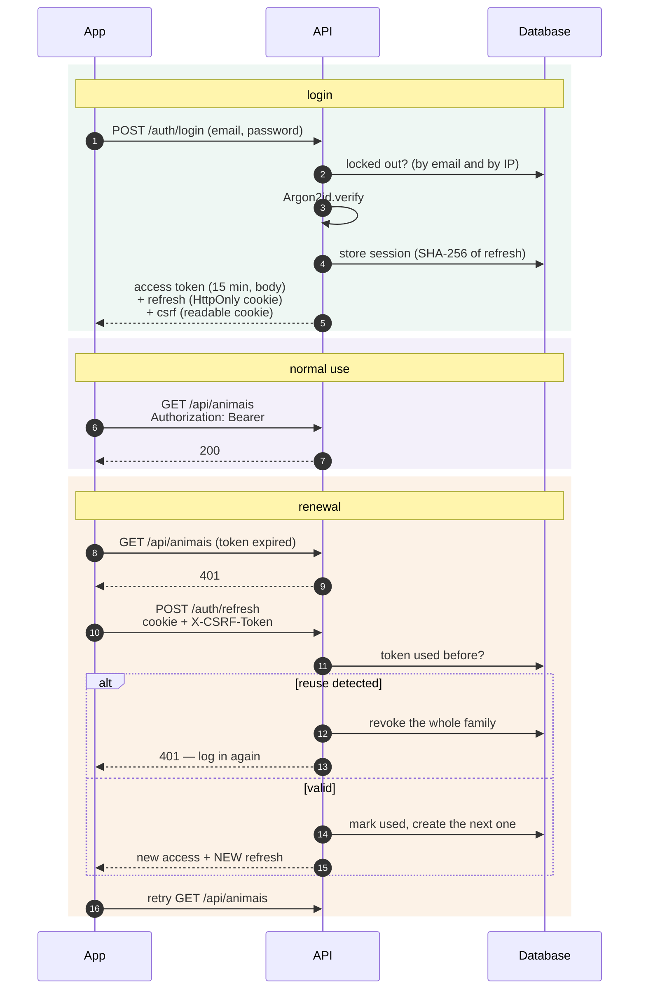
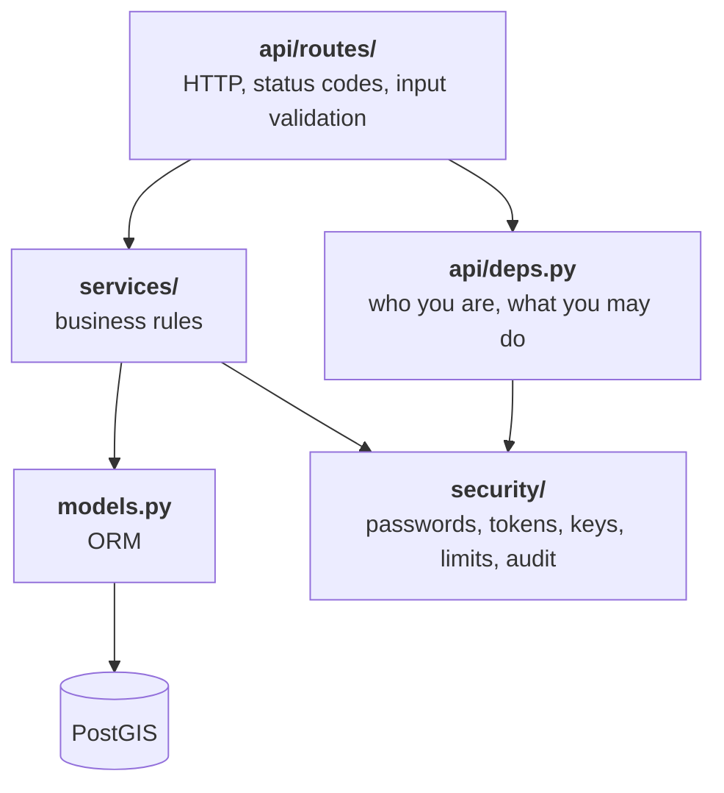
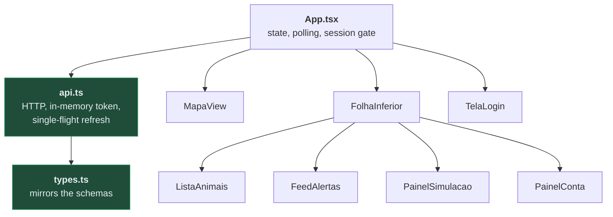

> [🇧🇷 Português](arquitetura.md) · 🇬🇧 **English**

# Architecture

Technical document for Rastro: how the pieces fit, why they are that way, and
where the boundaries are.

- [Overview](#overview)
- [Containers](#containers)
- [Data model](#data-model)
- [Telemetry flow](#telemetry-flow)
- [Alert lifecycle](#alert-lifecycle)
- [Authentication](#authentication)
- [Backend layers](#backend-layers)
- [Frontend](#frontend)
- [Known limits](#known-limits)

---

## Overview

The hardware does not exist yet. In the MVP, tag and gateway are played by a
**simulator** running inside the API, writing through the same path a real
gateway would use.

## Containers

The Vite proxy makes app and API share one browser origin. That is not
convenience: it is what allows `SameSite=strict` on the session cookie without
breaking anything.

`db` and `api` ports are published on `127.0.0.1`. Only `web` binds `0.0.0.0`,
so the app can be opened from a phone on the local network.

## Data model

Three decisions worth explaining:

**`ultima_geom` on the animal is deliberate denormalisation.** The map asks for
the whole herd's position every 3 s. Scanning `posicoes` for the latest row each
cycle would be expensive; keeping a copy of the last reading costs one column.

**`leituras_fora` and `imovel_desde` are alert-engine state, not animal state.**
They live here because the alternative — recomputing history on every reading —
would be more expensive without being more correct.

**`familia` on the session** groups the whole rotation chain of one login. It is
what makes revoking an entire stolen-token chain possible in one move.

## Telemetry flow

## Alert lifecycle

**Suspected** states raise no notification. They are what separates "GNSS
drifted" from "the animal left".

## Authentication

Design detail: the refresh token **never** appears in a response body. If it
did, the frontend would have to store it somewhere JavaScript can read, and one
XSS would carry the 14-day session away with it.

## Backend layers

The rule behind the cut: **routes hold no business rules, and services know
nothing about HTTP.** That is what lets the simulator and the telemetry endpoint
share `services/telemetria.py` with no duplication.

Authorisation is declared in `api/routes/__init__.py`, at `include_router`, not
per route. A new route is therefore born protected — leaving something open
requires explicitly moving it into the public group, which shows up in the diff.

## Frontend

`api.ts` and `types.ts` import nothing from React on purpose: the planned React
Native app reuses both unchanged.

## Known limits

| Limit | Consequence | When to fix |
|---|---|---|
| `create_all` instead of migrations | Schema changes require recreating the database | Before the first pilot with real data |
| 3 s polling | Constant traffic; up to 3 s alert latency | When client count justifies WebSocket |
| Single farm | `GET /api/fazenda` returns the first one | Before the second customer |
| No push | Alerts only exist while the app is open | The product's core promise — next priority |
| Simulator inside the API | Couples demo and production | When hardware arrives |
| Single API replica | Simulator and maintenance would double with 2+ replicas | Before scaling horizontally |
