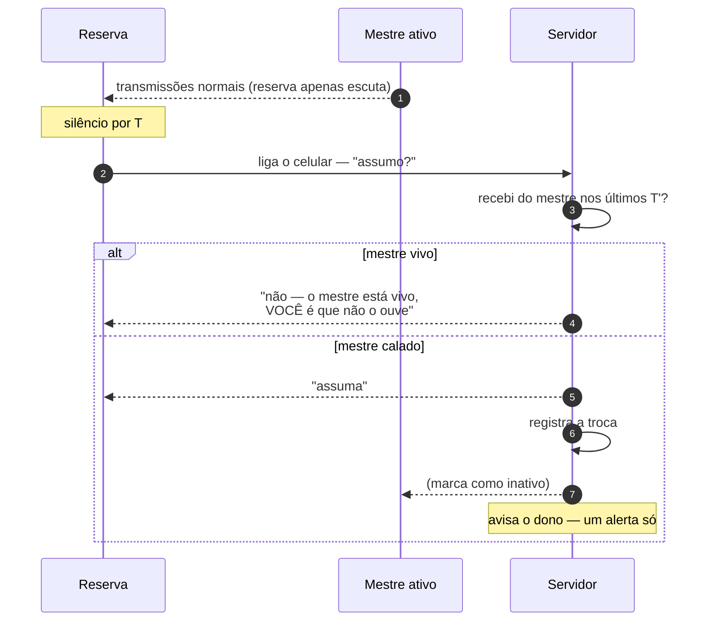

> 🇧🇷 **Português** · [🇬🇧 English](hardware-architecture.md)

# Arquitetura de hardware e modelo de custo

Como o rastreamento funciona do lado do campo, e quanto custa. O software desta
casa já está construído e verificado; isto aqui é o que ainda não existe.

> **Nada disto foi medido.** Todo número de custo e de alcance é estimativa de
> engenharia, marcada **[EST]**. Dois deles decidem se o desenho fecha, e ambos
> se medem numa tarde com R$ 500 em equipamento — ver
> [O que ainda é aposta](#o-que-ainda-é-aposta).

- [O problema](#o-problema)
- [As três camadas](#as-três-camadas)
- [Geocerca no dispositivo](#geocerca-no-dispositivo)
- [Eleição do mestre](#eleição-do-mestre)
- [Custo](#custo)
- [Preço](#preço)
- [O que ainda é aposta](#o-que-ainda-é-aposta)

---

## O problema

A proposta original era um dispositivo por animal falando direto com a
operadora. Isso não fecha para o pequeno produtor: **cada animal exigiria seu
próprio plano de dados**.

Sessenta cabeças, sessenta mensalidades.

O princípio que resolve — e que atravessa todo o projeto — é que **o rádio caro
não pode estar em cada animal**. Ele fica em poucos pontos, e o resto conversa
por rádio de faixa livre.

| Topologia | Mensal, 60 cabeças |
|---|---|
| Um chip celular por animal | ~R$ 900 |
| Três mestres por lote | ~R$ 90 |

## As três camadas

```mermaid
flowchart LR
    subgraph brincos["1 · BRINCOS — 51 animais"]
        direction TB
        b1["GNSS<br/><small>onde estou</small>"]
        b2["Acelerômetro<br/><small>estou me movendo</small>"]
        b3["Polígono do pasto<br/><small>estou dentro?</small>"]
        b4["Rádio LoRa<br/><small>avisa e repete</small>"]
    end

    subgraph malha["2 · MALHA"]
        m["O rebanho é a antena<br/><small>cada brinco repete</small>"]
    end

    subgraph mestres["3 · MESTRES — 9 brincos"]
        direction TB
        ma["Ativo<br/><small>modem + chip ligado</small>"]
        r1["Reserva 1<br/><small>só escuta</small>"]
        r2["Reserva 2<br/><small>só escuta</small>"]
    end

    srv[("Servidor<br/><small>árbitro</small>")]

    brincos --> malha --> mestres -->|celular| srv

    style b3 fill:#1f4d3a,stroke:#2e9e63,color:#fff
    style ma fill:#1f4d3a,stroke:#2e9e63,color:#fff
    style srv fill:#1f4d3a,stroke:#2e9e63,color:#fff
```

**Nada é instalado no pasto.** Sem antena em poste, sem energia da rede, sem
gateway fixo. Os mestres andam pendurados na orelha de alguns animais, junto
com o rebanho.

Consequência que não era o objetivo mas vale tanto quanto: um mestre que **anda
com o gado** tem cobertura melhor que uma torre fixa — está sempre no meio do
lote, não a três quilômetros dele. Isso resolve o caso de pastos distantes sem
multiplicar antena.

## Geocerca no dispositivo

O diferencial do produto é a geocerca, e **ela não pode depender de rádio**.

O polígono do pasto fica gravado no brinco. O teste ponto-em-polígono roda no
próprio microcontrolador, com o GNSS local — são cerca de vinte linhas de
firmware. O rádio serve apenas para **avisar**.

| Situação | Comportamento |
|---|---|
| Dentro do pasto | Posição a cada 30 min, potência baixa |
| **Cruzou a divisa** | Transmite na hora, potência máxima, repete até confirmar |

Isso dissolve o problema de alcance. Não é preciso enlace contínuo — é preciso
que **uma** mensagem passe. E ela precisa passar justamente quando o animal está
em campo aberto se afastando do lote, que é a melhor condição de propagação, não
a pior.

### A malha

Sessenta brincos são sessenta repetidores. O animal fora do alcance direto do
mestre tem sua mensagem retransmitida pelos vizinhos.

Não é invenção: o [Meshtastic](https://meshtastic.org/) faz exatamente isso, é
software aberto e maduro, e roda na mesma placa T-Beam usada no protótipo.

## Eleição do mestre

Três brincos por lote carregam modem celular. Um transmite; os outros escutam
calados.

Três decisões de projeto, cada uma corrigindo um jeito óbvio de errar:

**1. Escuta passiva, não interrogação.** O mestre já transmite continuamente
(está repassando o rebanho). A reserva apenas escuta; silêncio prolongado
significa queda. Ficar perguntando "está aí?" gastaria bateria das três e
ocuparia o canal — e o canal LoRa tem limite legal de tempo no ar.

**2. Quem decide é o servidor.** Se as reservas decidissem sozinhas, o cenário
mais comum do campo quebraria tudo: o mestre está **vivo**, mas a reserva não o
ouve — grota, mata, chuva. Ela assumiria, e passaria a haver **dois mestres**,
ambos gastando celular, ambos convictos, e como não se ouvem **isso nunca se
resolve**. Com um único árbitro, o cérebro dividido é impossível por construção.

**3. Rodízio por bateria, não só por falha.** O mestre gasta mais que os outros.
Se o papel só trocar quando alguém morre, vira cascata: morre um, o próximo
assume e morre também. O papel roda periodicamente para quem tem mais carga.

### O aviso ao dono vem do servidor

Se os três mestres caírem juntos, **nenhum consegue avisar**. Dispositivo não
reporta a própria morte.

Quem percebe é o servidor, pelo silêncio — e precisa emitir **um alerta só**
("rebanho sem comunicação"), não sessenta notificações de madrugada dizendo que
cada boi foi roubado. Um alarme falso desse tamanho encerra a relação com o
cliente.

## Autonomia de bateria

Estimativas [EST], derivadas do consumo de cada peça — não medidas.

| | Consumo/dia | Bateria | **Sem sol** | **Com sol** |
|---|---|---|---|---|
| **Brinco comum** | ~30 mAh | ~1.000 mAh | **~33 dias** | indefinido |
| **Mestre sem rodízio** | ~70 mAh | ~2.000 mAh | **~28 dias** | no limite |
| **Mestre com rodízio entre 3** | ~43 mAh | ~2.000 mAh | **~46 dias** | folgado |

**O rodízio não é só redundância — é o que faz a bateria do mestre fechar.** Um
mestre fixo consome mais do que um painel de brinco colhe num dia ruim. Dividido
entre três, o consumo médio de cada um cai para perto do de um brinco comum.

### O que de fato limita a vida útil

Nenhum dos números acima. São, em ordem:

1. **Retenção do brinco.** Bovino esfrega a cabeça em mourão e cerca. A perda
   física é o maior risco do projeto — mais que qualquer questão eletrônica.
2. **Envelhecimento da bateria.** Ciclando todo dia com solar, Li-ion dá
   500–1.000 ciclos: **2 a 3 anos**.
3. **Calor.** Brinco escuro ao sol em Minas passa de 60 °C. Li-ion degrada
   rápido acima de 45 °C — o que empurra o projeto para **LiFePO4**, que aguenta
   mais calor e mais ciclos ao custo de menos energia por grama.

Os 30 dias sem sol não são folga de projeto, são requisito: o painel **vai**
ficar coberto de lama e esterco.

## Custo

Cenário de referência: **60 vacas, 3 lotes de 20, 3 mestres por lote**.

Lotes que não se ouvem precisam cada um dos seus mestres — daí 9, e não 3.

### Composição do brinco [EST]

| Item | Comum | Mestre |
|---|---|---|
| MCU + rádio LoRa (SX1262) | R$ 25 | R$ 25 |
| GNSS | R$ 25 | R$ 25 |
| Acelerômetro | R$ 4 | R$ 4 |
| Bateria + célula solar | R$ 20 | R$ 40 |
| PCB + montagem | R$ 18 | R$ 33 |
| Encapsulamento + pino | R$ 18 | R$ 18 |
| **Modem celular** | — | **R$ 55** |
| **Total em escala** | **R$ 110** | **R$ 200** |
| **Total no piloto** (×~2,5) | **R$ 280** | **R$ 480** |

O mestre é o brinco comum mais R$ 90. O acréscimo é pequeno porque a única
diferença real é o modem.

### Total do sistema

| | Piloto (60 un.) | Escala |
|---|---|---|
| 51 brincos comuns | R$ 14.280 | R$ 5.610 |
| 9 brincos-mestre | R$ 4.320 | R$ 1.800 |
| **Hardware** | **R$ 18.600** | **R$ 7.410** |
| **Por cabeça** | **R$ 310** | **R$ 123** |

**Mensal:** 9 chips M2M × R$ 10 = R$ 90, mais ~R$ 20 de rateio de servidor =
**R$ 110/mês**.

### Custo de entrada do negócio

Não entra no preço do cliente, mas alguém paga:

| Item | [EST] |
|---|---|
| Projeto de PCB e antena | R$ 80.000 – 200.000 |
| **Homologação Anatel** | R$ 30.000 – 80.000 |
| Molde do encapsulamento | incluído acima |

Recalcule com números seus em [`ferramentas/modelo_custo.py`](../ferramentas/modelo_custo.py).

## Preço

O argumento de venda não é tecnologia:

> **Se evitar a perda de uma vaca por ano, já se pagou.**

Arroba do boi gordo em Minas: **R$ 331** ([CEPEA](https://cepea.org.br/br/indicador/boi-gordo.aspx),
10/08/2026). Vaca gorda fica R$ 30–35 abaixo. Uma vaca de 16 arrobas ≈
**R$ 4.800**; 60 vacas ≈ **R$ 288.000** andando no pasto.

### Modelo sugerido

| | Preço | 60 cabeças |
|---|---|---|
| Equipamento | R$ 280/cabeça | R$ 16.800 |
| Instalação e configuração | pacote | R$ 2.000 |
| Serviço mensal | R$ 5/cabeça | R$ 300/mês |

Para o produtor: R$ 3.600/ano ≈ **0,75 vaca**.
Para o fornecedor, em escala: **56% de margem** no equipamento e R$ 190/mês
recorrente.

### Ancoragem no mercado

| | Por cabeça | 60 cabeças |
|---|---|---|
| Ceres Tag | ~R$ 1.600 | R$ 96.000 |
| InstaBov | R$ 499 | R$ 29.940 |
| Halter | <US$ 100 + torre US$ 4.500 | ~R$ 56.000 |
| **Este projeto** | **R$ 280** | **R$ 16.800** |

Metade do concorrente nacional mais barato, e é a faixa que o pequeno produtor
de fato alcança.

### Os primeiros clientes não dão margem

No equipamento, o piloto sai no vermelho: custa R$ 18.525 e é vendido por
R$ 16.800 — **−R$ 1.725**. Com a instalação (R$ 2.000) a entrega fica no zero a
zero, e é só isso: zero. Sem contar homologação nem projeto de PCB.

Isso precisa ser **decisão consciente**, não descoberta. Os primeiros clientes
pagam em outra moeda: taxa real de perda de brinco, alcance medido em campo, e o
depoimento que vende o quarto cliente.

Cobre o preço de escala desde o início, mesmo perdendo. Subir preço depois é
muito mais difícil que baixar.

**Aluguel só fecha em escala.** Para recuperar hardware de piloto em 24 meses
seria preciso cobrar ~R$ 20/cabeça/mês — quase três vacas por ano, não vende. Em
escala vira R$ 9–11/cabeça/mês, aí fecha.

## O que ainda é aposta

Dois números sustentam tudo acima, e **nenhum foi medido**:

| Incógnita | O que decide | Como medir |
|---|---|---|
| **Alcance do LoRa rente ao chão**, no capim, com relevo | Quantos mestres por lote — o item mais caro | 2× T-Beam, uma tarde de campo |
| **Consumo real do mestre** | Se o painel de um brinco dá conta ou se precisa de coleira | Multímetro |

Um erro já cometido aqui: a primeira estimativa de consumo do mestre foi de
~250 mAh/dia e levou à conclusão de que só coleira serviria. Ela assumia **rádio
escutando o tempo todo** — o desenho ingênuo. Com escuta agendada e modo de
economia do NB-IoT, cai para ~70 mAh/dia e cabe no brinco.

A lição fica registrada: estimativa com premissa errada não erra por pouco,
erra por fator de três e muda a conclusão do projeto.

**Custo de eliminar as duas incógnitas: ~R$ 500 e uma tarde.** Sem comprar
modem, chip nem coleira.
