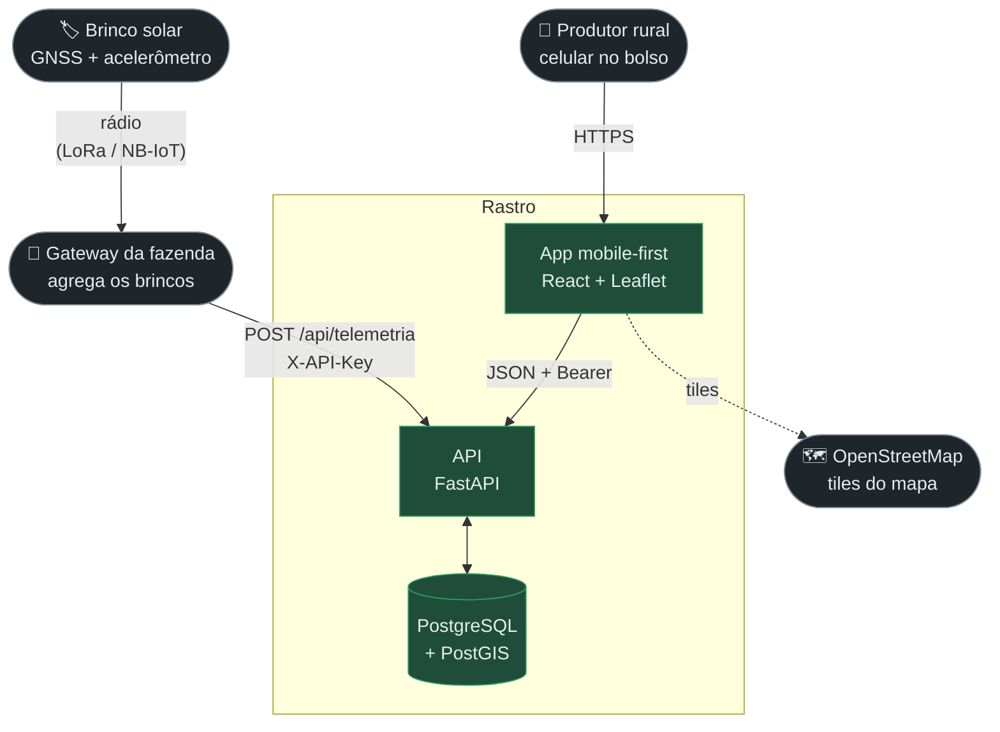
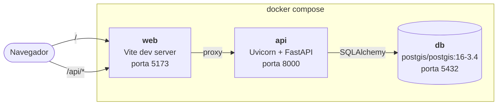
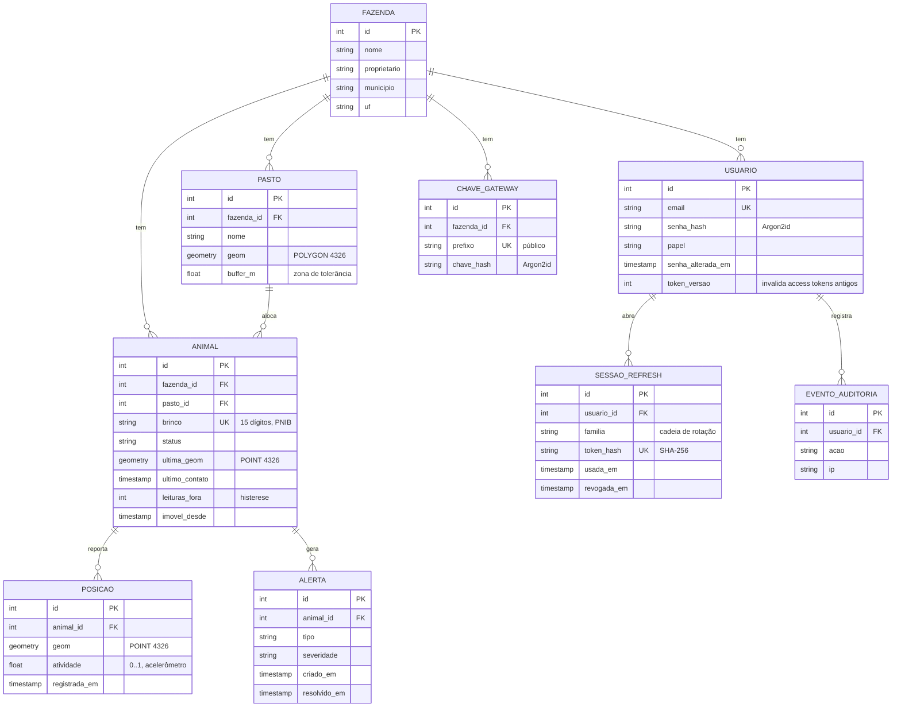
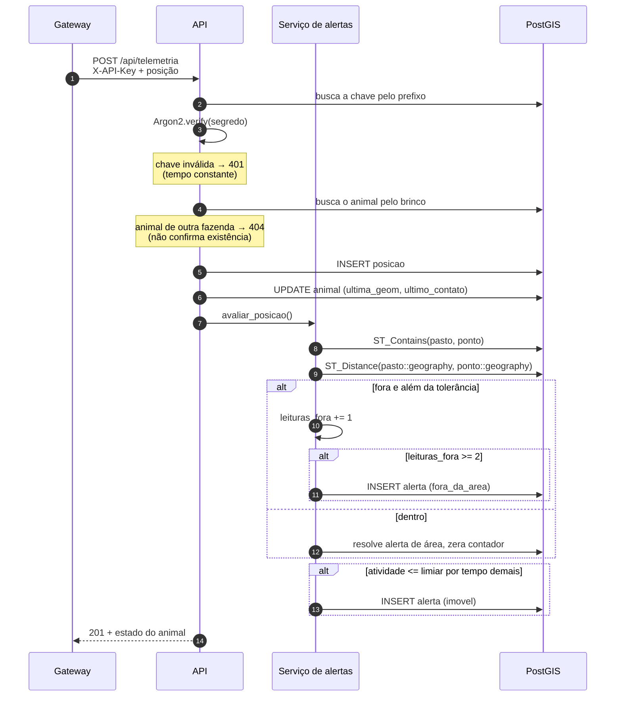
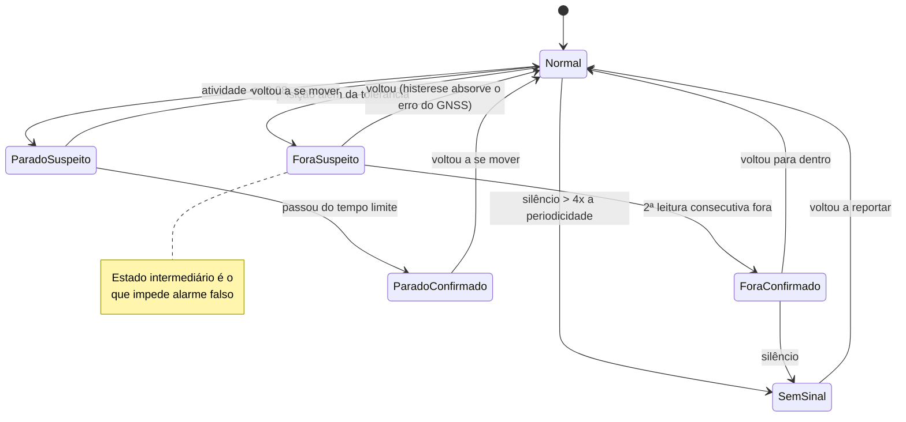
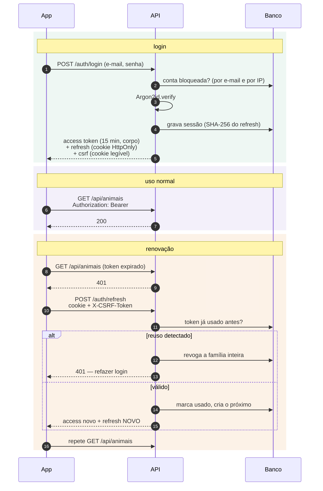
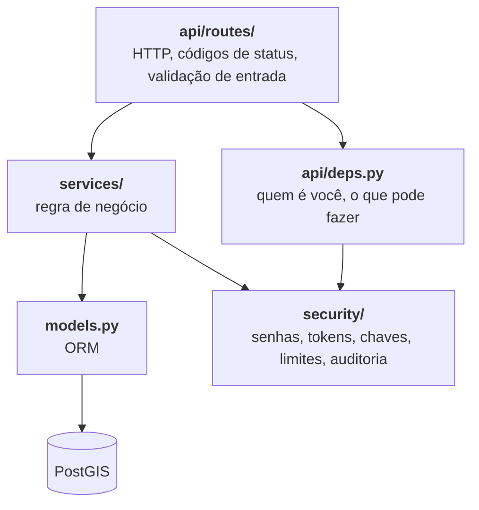
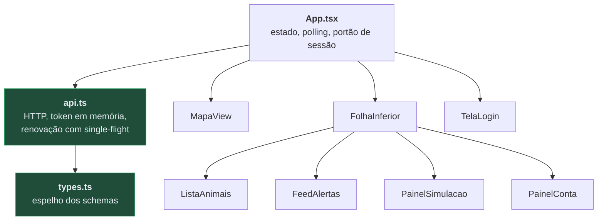

> 🇧🇷 **Português** · [🇬🇧 English](architecture.md)

# Arquitetura

Documento técnico do Rastro: como as partes se encaixam, por que estão assim e
onde estão os limites.

- [Visão geral](#visão-geral)
- [Containers](#containers)
- [Modelo de dados](#modelo-de-dados)
- [Fluxo de telemetria](#fluxo-de-telemetria)
- [Ciclo de vida do alerta](#ciclo-de-vida-do-alerta)
- [Autenticação](#autenticação)
- [Camadas do backend](#camadas-do-backend)
- [Frontend](#frontend)
- [Limites conhecidos](#limites-conhecidos)

---

## Visão geral

O hardware ainda não existe. No MVP, o papel de brinco e gateway é feito por um
**simulador** que roda dentro da API e escreve pelo mesmo caminho que o gateway
real usaria.

## Containers

O proxy do Vite faz o app e a API compartilharem a mesma origem no navegador.
Isso não é conveniência: é o que permite usar `SameSite=strict` no cookie de
sessão sem quebrar nada.

Portas `db` e `api` publicadas em `127.0.0.1`. Só a `web` fica em `0.0.0.0`,
para ser possível abrir o app no celular pela rede local.

## Modelo de dados

Três decisões que valem explicação:

**`ultima_geom` no animal é denormalização deliberada.** O mapa pede a posição
de todo o rebanho a cada 3 s. Buscar o último ponto varrendo `posicoes` a cada
ciclo custaria caro; manter uma cópia da última leitura custa uma coluna.

**`leituras_fora` e `imovel_desde` são estado do motor de alertas, não do
animal.** Ficam aqui porque a alternativa — recalcular o histórico a cada
leitura — seria mais cara sem ser mais correta.

**`familia` na sessão** agrupa toda a cadeia de rotações de um mesmo login. É o
que permite revogar um roubo de token inteiro de uma vez.

## Fluxo de telemetria

## Ciclo de vida do alerta

Os estados **suspeito** não geram notificação. São eles que separam "o GNSS
oscilou" de "o boi saiu".

## Autenticação

Detalhe do desenho: o refresh **nunca** aparece no corpo da resposta. Se
aparecesse, o front teria de guardá-lo em algum lugar que o JavaScript lê, e um
XSS levaria a sessão de 14 dias junto.

## Camadas do backend

Regra que orienta o corte: **rota não contém regra de negócio, e serviço não
conhece HTTP.** É o que permite o simulador e o endpoint de telemetria
compartilharem `services/telemetria.py` sem duplicar nada.

Autorização é declarada em `api/routes/__init__.py`, no `include_router`, não
rota a rota. Assim uma rota nova nasce protegida — para deixar algo aberto é
preciso adicioná-lo explicitamente ao grupo público, e isso aparece no diff.

## Frontend

`api.ts` e `types.ts` não importam nada do React de propósito: o app React
Native planejado reaproveita os dois sem alteração.

## Limites conhecidos

| Limite | Consequência | Quando resolver |
|---|---|---|
| `create_all` no lugar de migração | Mudança de schema exige recriar o banco | Antes do primeiro piloto com dados reais |
| Polling de 3 s | Tráfego constante; latência de até 3 s no alerta | Quando o número de clientes justificar WebSocket |
| Monofazenda | `GET /api/fazenda` devolve a primeira | Antes do segundo cliente |
| Sem push | O alerta só existe com o app aberto | É a promessa central do produto — próxima prioridade |
| Simulador embutido na API | Acoplamento entre demonstração e produção | Quando o hardware chegar |
| Uma réplica de API | O simulador e a manutenção duplicariam com 2+ réplicas | Antes de escalar horizontalmente |
