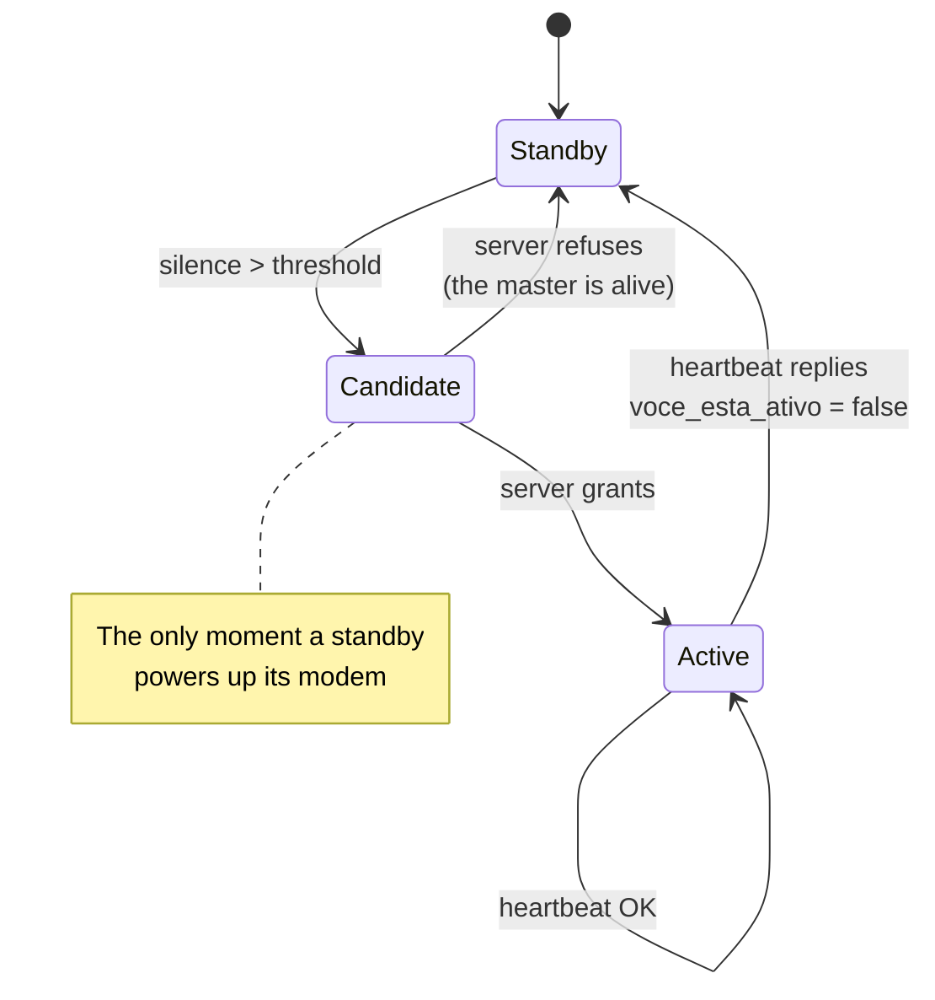

> [🇧🇷 Português](protocolo-dispositivos.md) · 🇬🇧 **English**

# Device protocol

What the boards say to the server. The firmware will be written against this
document.

> **The API already implements all of this and it is covered by automated
> tests.** The firmware does not exist — it needs boards in hand to be tested.

- [Identity](#identity)
- [Ordinary tag cycle](#ordinary-tag-cycle)
- [Master cycle](#master-cycle)
- [Endpoints](#endpoints)
- [Master state machine](#master-state-machine)

---

## Identity

Devices do not log in with email and password. Each **master** carries a gateway
key, created in the panel and flashed into the firmware:

```
X-API-Key: rastro_gw_<prefix>_<secret>
```

Ordinary tags **never talk to the server**. Only to the master, over radio. No
key, no modem, no data plan.

The key belongs to a farm: a master cannot report another property's cattle, and
a leaked key is revocable on its own without touching any human account.

## Ordinary tag cycle

```
every interval (default 30 min):
    power up GNSS, get a fix
    read accelerometer
    evaluate the polygon LOCALLY
    transmit over LoRa: tag id, lat, lon, activity, battery [, event]
    sleep
```

**The geofence runs on the device.** The polygon arrives once, via config, and
from then on the tag decides on its own — no link, no server. That is what makes
the escape alert independent of the animal being in radio range at the exact
moment it left.

When the tag detects a breach, it **escalates**:

| Situation | Behaviour |
|---|---|
| Inside | 1 transmission per interval, low power |
| **Outside, confirmed** | transmits immediately, full power, repeats until ACK |

The `evento` field carries the tag's decision. When it reads `saiu_da_area`, the
server **skips the second reading**: the device saw a series of positions the
server never did — it only transmits a fraction of them — and already applied
hysteresis locally.

## Master cycle

```
every interval:
    accumulate what was heard over LoRa
    power up the modem
    POST /api/dispositivos/telemetria   (the whole batch at once)
    POST /api/dispositivos/heartbeat    (piggybacking the connection)
    if response.voce_esta_ativo == false:
        power down the modem, go back to standby
    power down the modem
```

Powering the modem is the master's biggest energy cost. One connection carrying
twenty readings costs nearly the same as one carrying a single reading — hence
batching.

A standby does none of that. It only listens:

```
while standby:
    listen to the radio
    if the master was heard → sleep
    if silence > threshold:
        power up the modem
        POST /api/dispositivos/assumir
        if granted → become master
        else → sleep for `tente_de_novo_em_s` and go back to listening
```

**A standby never asks "are you there?".** It listens for silence. Polling would
drain all three batteries and occupy a channel with a legal airtime limit.

## Endpoints

All require `X-API-Key`.

| Method | Path | Purpose |
|---|---|---|
| `GET` | `/api/dispositivos/config` | Fetch polygons and thresholds to distribute over radio |
| `POST` | `/api/dispositivos/telemetria` | Upload the accumulated batch of readings |
| `POST` | `/api/dispositivos/heartbeat` | "I'm alive" + battery; learns whether it is still in charge |
| `POST` | `/api/dispositivos/assumir` | A standby asks to take over; **the server decides** |
| `POST` | `/api/telemetria` | Single reading — exists for `curl` testing |

### `GET /api/dispositivos/config`

```json
{
  "versao": "a3f9c21b8e4d5f70",
  "intervalo_reporte_s": 1800,
  "imobilidade_segundos": 14400,
  "imobilidade_atividade_max": 0.08,
  "heartbeat_mestre_s": 900,
  "pastos": [
    { "id": 1, "pontos": [[-19.751, -47.936], [-19.751, -47.930]], "buffer_m": 25.0 }
  ],
  "animais": [{ "brinco": "076000000000001", "pasto_id": 1 }]
}
```

`versao` is a digest of the content. The master stores the last one and **only
redistributes over radio when it changes** — radio, not cellular bandwidth, is
the scarce resource.

### `POST /api/dispositivos/telemetria`

```json
{
  "leituras": [
    { "brinco": "076000000000001", "lat": -19.7485, "lon": -47.9330,
      "atividade": 0.62, "bateria_pct": 88 },
    { "brinco": "076000000000002", "lat": -19.7601, "lon": -47.9330,
      "atividade": 0.71, "bateria_pct": 91, "evento": "saiu_da_area" }
  ],
  "bateria_mestre_pct": 74
}
```

Response:

```json
{ "aceitas": 2, "recusadas": 0, "desconhecidos": [] }
```

One bad reading **does not sink the batch**: the good ones land, and unknown tag
ids come back so the master can stop relaying them.

Accepted events: `saiu_da_area`, `voltou_para_area`, `imovel`, `movimentou`.

### `POST /api/dispositivos/heartbeat`

```json
{ "bateria_pct": 74 }
```

```json
{ "voce_esta_ativo": true, "proximo_heartbeat_s": 900 }
```

`voce_esta_ativo` is an **order, not information**. A master that went
unreachable and came back learns here that it was replaced, and must power down
its modem — otherwise it would transmit in parallel with whoever took over.

### `POST /api/dispositivos/assumir`

No body. Response:

```json
{ "assumiu": false, "motivo": "o mestre em servico esta vivo",
  "tente_de_novo_em_s": 47 }
```

`tente_de_novo_em_s` keeps the standby from asking every second and burning
battery for nothing.

## Master state machine



The **Candidate** state is what prevents split-brain. Without it, a standby
would go straight from Standby to Active on its own — and the common field case
is the master being alive while the standby simply cannot hear it, because of a
gully, trees or rain. Two masters would end up transmitting, both convinced, and
since they cannot hear each other it would never resolve.

The guarantee is not only in code: a **partial unique index in the database**
refuses two active masters in the same lot, including in a race between two
simultaneous requests.

## Collective silence

If the master goes down and no standby takes over, **the whole lot falls silent
at once**.

The server treats that as a single event: when 60% or more of a lot goes quiet,
it raises **one** `lote_sem_comunicacao` alert instead of N ripped-off-tag
alerts.

Without it, one master failure would become twenty middle-of-the-night
notifications claiming every animal was stolen. False, and enough for the
rancher to uninstall the app — which is the product's biggest risk, above any
technical concern.

## What is missing

The firmware. It depends on boards in hand, because the two numbers that define
the transmission cycle — **real LoRa range at ground level** and **measured
power draw** — are still estimates. See
[hardware architecture](hardware-architecture.md#still-a-bet).
