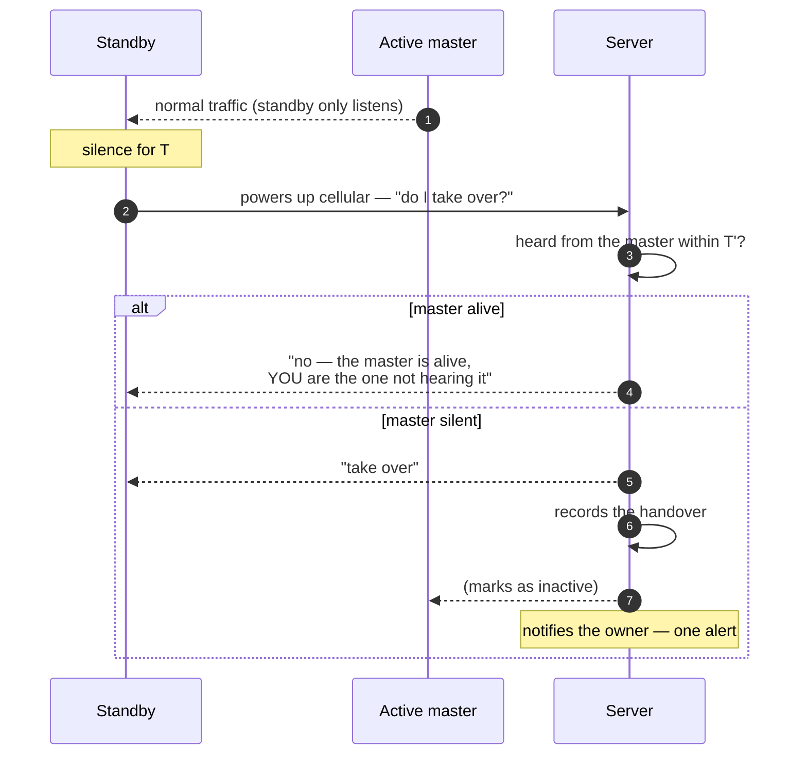

> [🇧🇷 Português](arquitetura-hardware.md) · 🇬🇧 **English**

# Hardware architecture and cost model

How tracking works on the field side, and what it costs. The software in this
repository is built and verified; this is what does not exist yet.

> **None of this has been measured.** Every cost and range figure is an
> engineering estimate, marked **[EST]**. Two of them decide whether the design
> closes at all, and both can be measured in an afternoon with R$ 500 of
> equipment — see [Still a bet](#still-a-bet).

- [The problem](#the-problem)
- [Three layers](#three-layers)
- [Geofence on the device](#geofence-on-the-device)
- [Master election](#master-election)
- [Battery life](#battery-life)
- [Cost](#cost)
- [Pricing](#pricing)
- [Still a bet](#still-a-bet)

---

## The problem

The original proposal was one device per animal talking directly to a carrier.
That does not work for a small landholder: **every animal would need its own
data plan**.

Sixty head, sixty monthly bills.

The principle that solves it — and it runs through the whole project — is that
**the expensive radio cannot sit on every animal**. It sits at a few points, and
everything else talks over licence-free radio.

| Topology | Monthly, 60 head |
|---|---|
| One cellular SIM per animal | ~R$ 900 |
| Three masters per lot | ~R$ 90 |

## Three layers

```mermaid
flowchart LR
    subgraph tags["1 · TAGS — 51 animals"]
        direction TB
        b1["GNSS<br/><small>where am I</small>"]
        b2["Accelerometer<br/><small>am I moving</small>"]
        b3["Pasture polygon<br/><small>am I inside?</small>"]
        b4["LoRa radio<br/><small>report and relay</small>"]
    end

    subgraph mesh["2 · MESH"]
        m["The herd is the antenna<br/><small>every tag relays</small>"]
    end

    subgraph masters["3 · MASTERS — 9 tags"]
        direction TB
        ma["Active<br/><small>modem + SIM on</small>"]
        r1["Standby 1<br/><small>listens only</small>"]
        r2["Standby 2<br/><small>listens only</small>"]
    end

    srv[("Server<br/><small>arbiter</small>")]

    tags --> mesh --> masters -->|cellular| srv

    style b3 fill:#1f4d3a,stroke:#2e9e63,color:#fff
    style ma fill:#1f4d3a,stroke:#2e9e63,color:#fff
    style srv fill:#1f4d3a,stroke:#2e9e63,color:#fff
```

**Nothing is installed in the pasture.** No mast, no mains power, no fixed
gateway. The masters hang from the ears of a few animals, moving with the herd.

A consequence that was not the goal but matters as much: a master that **walks
with the cattle** has better coverage than a fixed tower — it is always in the
middle of the lot, not three kilometres away. That solves distant pastures
without multiplying antennas.

## Geofence on the device

The geofence is the product's differentiator, and **it cannot depend on radio**.

The pasture polygon is stored on the tag. The point-in-polygon test runs on the
microcontroller against the local GNSS fix — about twenty lines of firmware. The
radio only exists to **report**.

| Situation | Behaviour |
|---|---|
| Inside the pasture | Position every 30 min, low power |
| **Crossed the boundary** | Transmits immediately, full power, repeats until acknowledged |

This dissolves the range problem. A continuous link is not required — a *single*
message getting through is. And it needs to get through precisely when the
animal is in open ground moving away from the herd, which is the best
propagation condition, not the worst.

### The mesh

Sixty tags are sixty relays. An animal out of direct range of the master has its
message forwarded by neighbours.

Not speculation: [Meshtastic](https://meshtastic.org/) does exactly this, is
mature open-source software, and runs on the same T-Beam board used for the
prototype.

## Master election

Three tags per lot carry a cellular modem. One transmits; the others listen in
silence.

Three design decisions, each correcting an obvious way to get this wrong:

**1. Passive listening, not polling.** The master already transmits continuously
(it is relaying the herd). Standbys just listen; prolonged silence means it is
down. Asking "are you there?" would drain all three batteries and occupy the
channel — and LoRa has a legal airtime limit.

**2. The server decides.** If standbys decided on their own, the most common
field scenario would break everything: the master is **alive**, but a standby
cannot hear it — a gully, trees, rain. It would promote itself, and there would
be **two masters**, both burning cellular, both convinced, and since they cannot
hear each other **this never resolves**. With a single arbiter, split-brain is
impossible by construction.

**3. Rotation by battery, not only on failure.** The master drains faster than
the others. If the role only changed on death, it would cascade: one dies, the
next takes over and dies too. The role rotates periodically to whoever has the
most charge.

### The owner is notified by the server

If all three masters go down together, **none of them can report it**. A device
does not report its own death.

The server notices through silence — and must raise **one** alert ("herd out of
contact"), not sixty middle-of-the-night notifications claiming every animal was
stolen. A false alarm that size ends the customer relationship.

## Battery life

Estimates [EST], derived from per-component draw — not measured.

| | Draw/day | Battery | **No sun** | **With sun** |
|---|---|---|---|---|
| **Ordinary tag** | ~30 mAh | ~1,000 mAh | **~33 days** | indefinite |
| **Master, no rotation** | ~70 mAh | ~2,000 mAh | **~28 days** | marginal |
| **Master, rotating across 3** | ~43 mAh | ~2,000 mAh | **~46 days** | comfortable |

**Rotation is not only redundancy — it is what makes the master's battery
work.** A fixed master draws more than an ear-tag panel harvests on a bad day.
Split across three, each one's average lands close to an ordinary tag.

### What actually limits service life

None of the numbers above. In order:

1. **Tag retention.** Cattle rub their heads on posts and fences. Physical loss
   is the project's biggest risk — bigger than any electronic concern.
2. **Battery ageing.** Cycling daily on solar, Li-ion gives 500–1,000 cycles:
   **2 to 3 years**.
3. **Heat.** A dark tag in the Minas Gerais sun passes 60 °C. Li-ion degrades
   quickly above 45 °C, which pushes the design toward **LiFePO4** — more heat
   tolerance and more cycles, at the cost of energy per gram.

The 30 days without sun are not design slack, they are a requirement: the panel
**will** get caked in mud and manure.

## Cost

Reference scenario: **60 cows, 3 lots of 20, 3 masters per lot**.

Lots that cannot hear each other each need their own masters — hence 9, not 3.

### Tag bill of materials [EST]

| Item | Ordinary | Master |
|---|---|---|
| MCU + LoRa radio (SX1262) | R$ 25 | R$ 25 |
| GNSS | R$ 25 | R$ 25 |
| Accelerometer | R$ 4 | R$ 4 |
| Battery + solar cell | R$ 20 | R$ 40 |
| PCB + assembly | R$ 18 | R$ 33 |
| Enclosure + pin | R$ 18 | R$ 18 |
| **Cellular modem** | — | **R$ 55** |
| **At scale** | **R$ 110** | **R$ 200** |
| **Pilot** (×~2.5) | **R$ 275** | **R$ 500** |

The master is an ordinary tag plus R$ 90. The premium is small because the only
real difference is the modem.

### System total

| | Pilot (60 units) | At scale |
|---|---|---|
| 51 ordinary tags | R$ 14,025 | R$ 5,610 |
| 9 master tags | R$ 4,500 | R$ 1,800 |
| **Hardware** | **R$ 18,525** | **R$ 7,410** |
| **Per head** | **R$ 309** | **R$ 123** |

**Monthly:** 9 M2M SIMs × R$ 10 = R$ 90, plus ~R$ 20 of server share =
**R$ 110/month**.

### Business entry cost

Not part of the customer price, but somebody pays it:

| Item | [EST] |
|---|---|
| PCB and antenna design | R$ 80,000 – 200,000 |
| **Anatel type approval** | R$ 30,000 – 80,000 |

Recalculate with your own numbers in
[`ferramentas/modelo_custo.py`](../ferramentas/modelo_custo.py).

## Pricing

The sales argument is not technology:

> **If it prevents the loss of one cow a year, it has already paid for itself.**

Live cattle arroba in Minas Gerais: **R$ 331**
([CEPEA](https://cepea.org.br/br/indicador/boi-gordo.aspx), 2026-08-10). Cows
trade R$ 30–35 below that. A 16-arroba cow ≈ **R$ 4,800**; 60 cows ≈
**R$ 288,000** walking around the pasture.

### Suggested model

| | Price | 60 head |
|---|---|---|
| Equipment | R$ 280/head | R$ 16,800 |
| Installation and setup | package | R$ 2,000 |
| Monthly service | R$ 5/head | R$ 300/month |

For the rancher: R$ 3,600/year ≈ **0.75 of a cow**.
For the vendor, at scale: **56% gross margin** on equipment plus R$ 190/month
recurring.

### Market anchors

| | Per head | 60 head |
|---|---|---|
| Ceres Tag | ~R$ 1,600 | R$ 96,000 |
| InstaBov | R$ 499 | R$ 29,940 |
| Halter | <US$ 100 + US$ 4,500 tower | ~R$ 56,000 |
| **This project** | **R$ 280** | **R$ 16,800** |

Half the cheapest Brazilian competitor, and it is the bracket a small landholder
can actually reach.

### The first customers carry no margin

On equipment the pilot runs at a loss: it costs R$ 18,525 and sells for
R$ 16,800 — **−R$ 1,725**. With installation (R$ 2,000) the delivery breaks
even, and that is all it does: break even. Before type approval or PCB design.

This must be a **conscious decision**, not a discovery. Those first customers
pay in a different currency: real tag-loss rates, field-measured range, and the
testimonial that sells the fourth customer.

Charge the at-scale price from day one, even at a loss. Raising a price later is
far harder than lowering one.

**Rental only closes at scale.** Recovering pilot hardware over 24 months would
require ~R$ 20/head/month — nearly three cows a year, which does not sell. At
scale it becomes R$ 9–11/head/month, which does.

## Still a bet

Two numbers hold up everything above, and **neither has been measured**:

| Unknown | What it decides | How to measure |
|---|---|---|
| **LoRa range at ground level**, in tall grass, over terrain | Masters per lot — the most expensive line item | 2× T-Beam, one afternoon in the field |
| **Real master power draw** | Whether an ear-tag panel suffices or a collar is required | Multimeter |

A mistake already made here: the first master power estimate was ~250 mAh/day
and led to the conclusion that only a collar could work. It assumed **the radio
listening continuously** — the naive design. With scheduled listening windows
and NB-IoT power saving it drops to ~70 mAh/day and fits in a tag.

The lesson is on the record: an estimate built on a wrong assumption does not
miss by a little. It misses by a factor of three and changes the project's
conclusion.

**Cost to eliminate both unknowns: ~R$ 500 and an afternoon.** No modem, SIM or
collar required.
