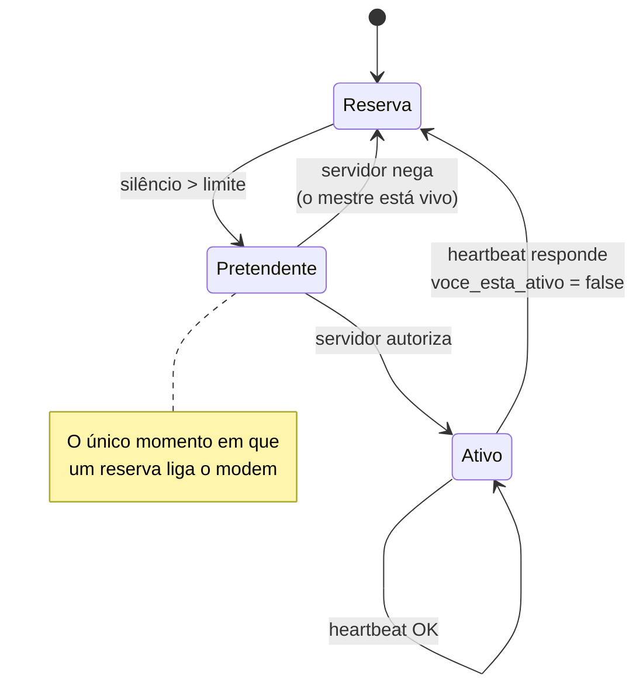

> 🇧🇷 **Português** · [🇬🇧 English](device-protocol.md)

# Protocolo dos dispositivos

O que as placas falam com o servidor. É contra este documento que o firmware
será escrito.

> **A API já implementa tudo aqui e tem teste automatizado.** O firmware não
> existe — depende de placa na mão para ser testado.

- [Identidade](#identidade)
- [Ciclo do brinco comum](#ciclo-do-brinco-comum)
- [Ciclo do mestre](#ciclo-do-mestre)
- [Endpoints](#endpoints)
- [Máquina de estados do mestre](#máquina-de-estados-do-mestre)

---

## Identidade

Dispositivo não faz login com e-mail e senha. Cada **mestre** carrega uma chave
de gateway, criada no painel e gravada no firmware:

```
X-API-Key: rastro_gw_<prefixo>_<segredo>
```

Brincos comuns **não falam com o servidor**. Só com o mestre, por rádio. Não têm
chave, não têm modem, não têm plano.

A chave é da fazenda: um mestre não consegue reportar gado de outra
propriedade, e uma chave vazada é revogável sozinha, sem tocar em conta de
gente.

## Ciclo do brinco comum

```
a cada intervalo (padrão 30 min):
    ligar GNSS, obter posição
    ler acelerômetro
    avaliar o polígono LOCALMENTE
    transmitir por LoRa: brinco, lat, lon, atividade, bateria [, evento]
    dormir
```

**A geocerca roda no dispositivo.** O polígono chega uma vez, pela configuração,
e depois o brinco decide sozinho — sem enlace, sem servidor. É isso que faz o
alerta de fuga não depender de o animal estar ao alcance no momento exato em que
saiu.

Quando o brinco detecta a saída, ele **escala**:

| Situação | Comportamento |
|---|---|
| Dentro | 1 transmissão por intervalo, potência baixa |
| **Fora, confirmado** | transmite imediatamente, potência máxima, repete até ACK |

O campo `evento` carrega a decisão do brinco. Quando vem `saiu_da_area`, o
servidor **dispensa a segunda leitura**: o dispositivo teve acesso a uma série
de posições que o servidor nunca viu — ele só transmite uma fração delas — e já
aplicou a histerese localmente.

## Ciclo do mestre

```
a cada intervalo:
    acumular o que ouviu por LoRa
    ligar o modem
    POST /api/dispositivos/telemetria   (o lote inteiro de uma vez)
    POST /api/dispositivos/heartbeat    (aproveitando a conexão)
    se resposta.voce_esta_ativo == false:
        desligar o modem, voltar a ser reserva
    desligar o modem
```

Ligar o modem é o que mais gasta bateria do mestre. Uma conexão para vinte
leituras custa quase o mesmo que uma conexão para uma — daí o envio em lote.

O reserva não faz nada disso. Só escuta:

```
enquanto reserva:
    escutar o rádio
    se ouviu o mestre → dormir
    se silêncio > limite:
        ligar o modem
        POST /api/dispositivos/assumir
        se assumiu → virar mestre
        senão → dormir por `tente_de_novo_em_s` e voltar a escutar
```

**A reserva nunca pergunta "está aí?".** Escuta o silêncio. Interrogar gastaria
bateria das três e ocuparia um canal que tem limite legal de tempo no ar.

## Endpoints

Todos exigem `X-API-Key`.

| Método | Rota | Para quê |
|---|---|---|
| `GET` | `/api/dispositivos/config` | Baixa polígonos e limiares para distribuir por rádio |
| `POST` | `/api/dispositivos/telemetria` | Sobe o lote de leituras acumuladas |
| `POST` | `/api/dispositivos/heartbeat` | "Estou vivo" + bateria; recebe se ainda está no comando |
| `POST` | `/api/dispositivos/assumir` | Reserva pede para assumir; **o servidor decide** |
| `POST` | `/api/telemetria` | Leitura avulsa — existe para teste com `curl` |

### `GET /api/dispositivos/config`

```json
{
  "versao": "a3f9c21b8e4d5f70",
  "intervalo_reporte_s": 1800,
  "imobilidade_segundos": 14400,
  "imobilidade_atividade_max": 0.08,
  "heartbeat_mestre_s": 900,
  "pastos": [
    { "id": 1, "pontos": [[-19.751, -47.936], [-19.751, -47.930]], "buffer_m": 25.0 }
  ],
  "animais": [{ "brinco": "076000000000001", "pasto_id": 1 }]
}
```

`versao` é um resumo do conteúdo. O mestre guarda a última e **só redistribui
por rádio quando muda** — rádio é o recurso escasso, não a banda celular.

### `POST /api/dispositivos/telemetria`

```json
{
  "leituras": [
    { "brinco": "076000000000001", "lat": -19.7485, "lon": -47.9330,
      "atividade": 0.62, "bateria_pct": 88 },
    { "brinco": "076000000000002", "lat": -19.7601, "lon": -47.9330,
      "atividade": 0.71, "bateria_pct": 91, "evento": "saiu_da_area" }
  ],
  "bateria_mestre_pct": 74
}
```

Resposta:

```json
{ "aceitas": 2, "recusadas": 0, "desconhecidos": [] }
```

Uma leitura ruim **não derruba o lote**: as boas entram, e os brincos
desconhecidos voltam na resposta para o mestre parar de repassá-los.

Eventos aceitos: `saiu_da_area`, `voltou_para_area`, `imovel`, `movimentou`.

### `POST /api/dispositivos/heartbeat`

```json
{ "bateria_pct": 74 }
```

```json
{ "voce_esta_ativo": true, "proximo_heartbeat_s": 900 }
```

`voce_esta_ativo` é **ordem, não informação**. Um mestre que ficou incomunicável
e voltou descobre aqui que foi substituído, e deve desligar o modem — senão
passaria a transmitir em paralelo com quem assumiu no lugar dele.

### `POST /api/dispositivos/assumir`

Sem corpo. Resposta:

```json
{ "assumiu": false, "motivo": "o mestre em servico esta vivo",
  "tente_de_novo_em_s": 47 }
```

`tente_de_novo_em_s` evita o reserva perguntar de segundo em segundo e gastar
bateria à toa.

## Máquina de estados do mestre



O estado **Pretendente** é o que impede o cérebro dividido. Sem ele, o reserva
iria direto de Reserva para Ativo por conta própria — e o caso comum de campo é
o mestre estar vivo e o reserva simplesmente não ouvi-lo, por causa de grota,
mata ou chuva. Passariam a existir dois mestres transmitindo, ambos convictos, e
como não se ouvem isso nunca se resolveria.

A trava não está só no código: há **índice único parcial no banco** recusando
dois ativos no mesmo lote, inclusive numa corrida entre dois pedidos
simultâneos.

## Silêncio coletivo

Se o mestre cai e nenhum reserva assume, **o lote inteiro cala ao mesmo tempo**.

O servidor trata isso como um evento só: quando 60% ou mais de um lote silencia,
abre **um** alerta de `lote_sem_comunicacao` em vez de N alertas de brinco
arrancado.

Sem isso, uma queda de mestre viraria vinte notificações de madrugada dizendo
que cada boi foi roubado. Falso, e o suficiente para o produtor desinstalar o
aplicativo — que é o maior risco do produto, acima de qualquer questão técnica.

## O que falta

O firmware. Ele depende de placa na mão, porque os dois números que definem o
ciclo de transmissão — **alcance real do LoRa rente ao chão** e **consumo
medido** — ainda são estimativa. Ver
[arquitetura de hardware](arquitetura-hardware.md#o-que-ainda-é-aposta).
